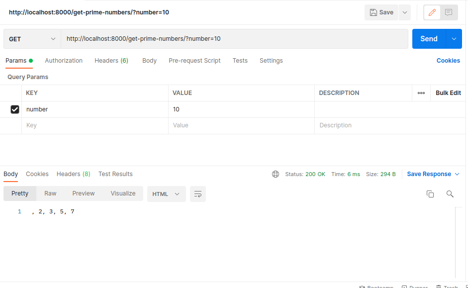
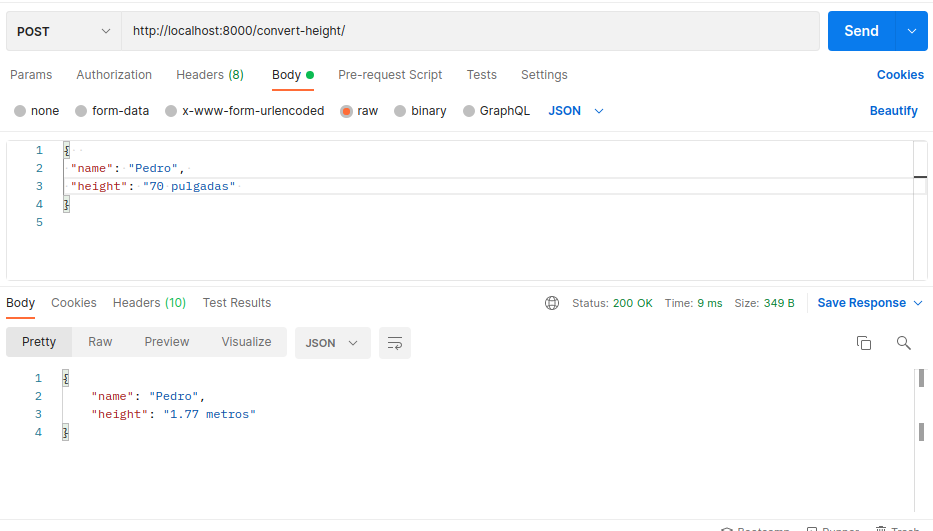
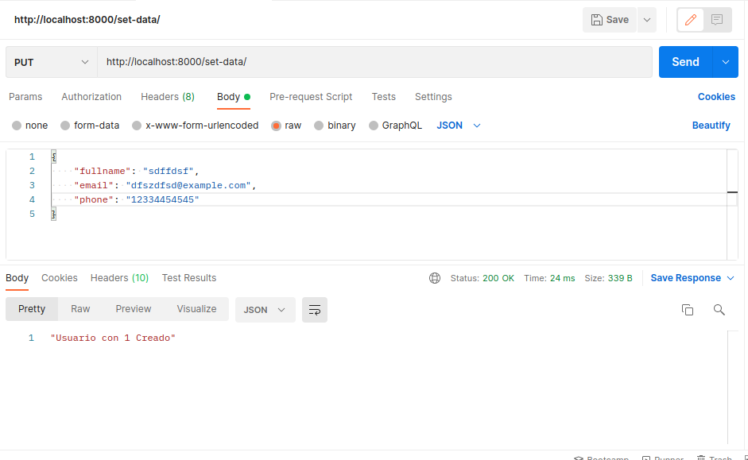

# Instalar #
Para instalar todas las dependencias del proyecto debemos correr: 

    - pip install -r requirements.txt

# URLS #

    - http://localhost:8000/get-prime-numbers/?number=10

    

    - http://localhost:8000/convert-height/

    Solicitud de ejemplo:
        {  
            "name": "Pedro", 
            "height": "70 pulgadas" 
        }

    

    - http://localhost:8000/set-data/

    Solicitud de ejemplo:
        {  
            "fullname": "sdffdsf",
            "email": "dfszdfsd@example.com",
            "phone": "12334454545"
        }
    
    
    
